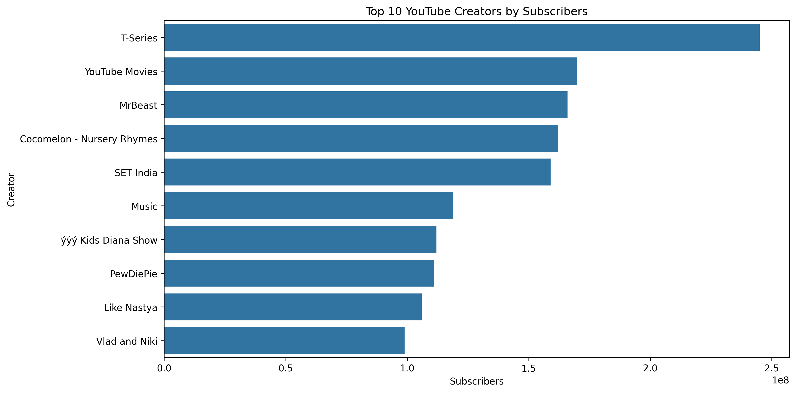
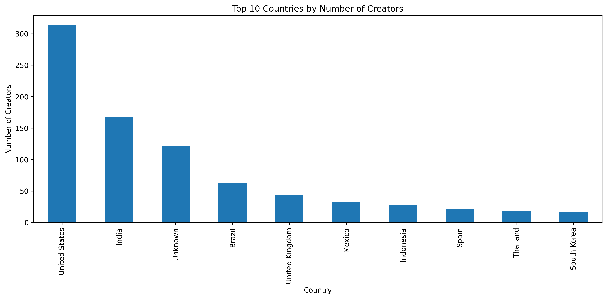
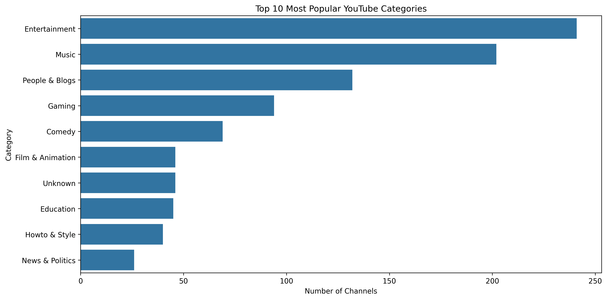
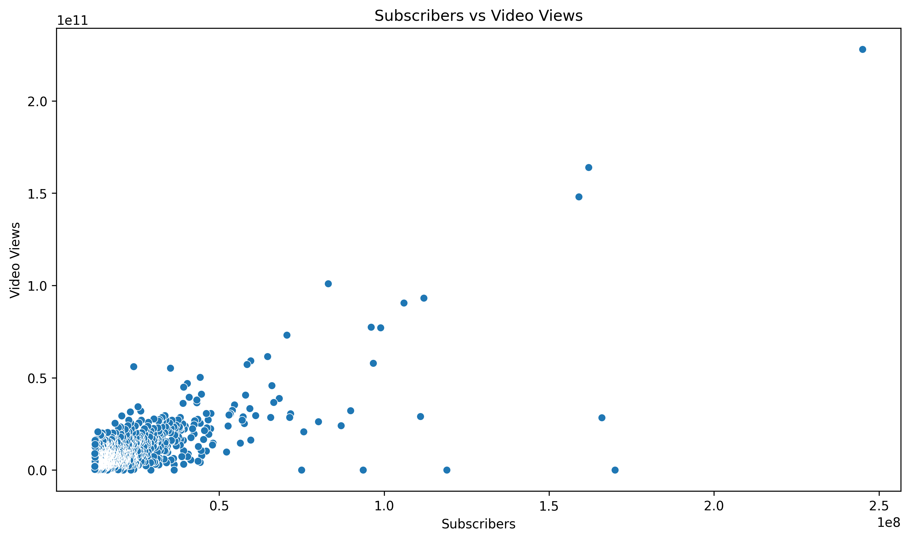
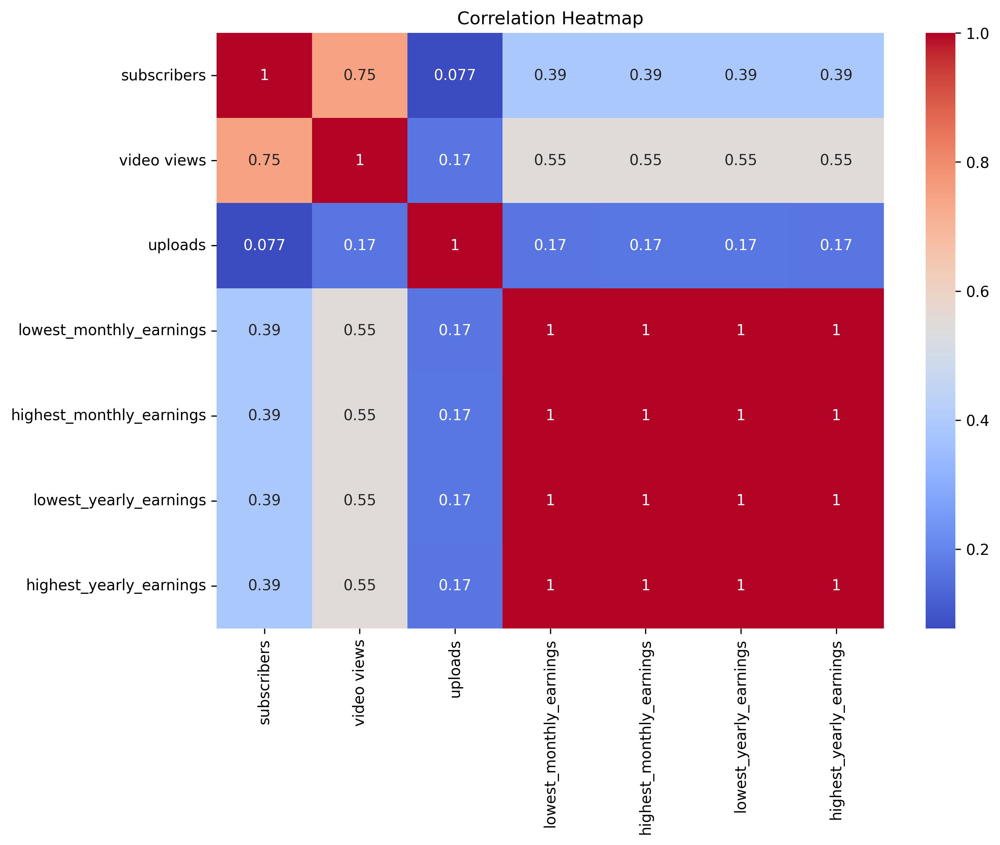

# 📊 Global YouTube Statistics - Exploratory Data Analysis

## 📌 Project Overview

This project performs Exploratory Data Analysis (EDA) on a dataset containing statistics of the world's top YouTube channels.

The objective was to explore the dataset, identify trends and patterns, detect data quality issues, and generate insights using statistical analysis and visualizations.

---

## 🎯 Objectives

* Ask meaningful questions about the dataset before analysis
* Explore data structure, variables, and data types
* Identify trends, patterns, and anomalies
* Test assumptions using statistics and visualizations
* Detect potential data quality issues

---

## 🛠️ Tools & Technologies

* Python
* Pandas
* NumPy
* Matplotlib
* Seaborn
* Jupyter Notebook
* Git & GitHub

---

## 📂 Dataset Information

* Dataset: Global YouTube Statistics
* Records: 995
* Features: 28

Key attributes include:

* Subscribers
* Video Views
* Upload Count
* Country
* Category
* Channel Type
* Earnings Information

---

## 🔍 Questions Explored

1. Which YouTube channels have the highest subscriber counts?
2. Which countries have the most top creators?
3. Which content categories dominate YouTube?
4. Is there a relationship between subscribers and video views?
5. Which variables show strong correlations?

---

## 🧹 Data Cleaning

* Checked dataset dimensions and structure
* Identified missing values
* Verified duplicate records
* Filled missing values in Country and Category columns
* Prepared data for visualization

---

## 📈 Visualizations

### Top 10 YouTube Creators by Subscribers



---

### Country-wise Creator Distribution



---

### Most Popular Content Categories



---

### Subscribers vs Video Views



---

### Correlation Heatmap



---

## 📊 Key Findings

* A small number of creators dominate YouTube's subscriber base.
* The United States has the highest number of top creators.
* Entertainment and Music are among the most popular categories.
* Subscriber count and video views have a strong positive relationship.
* Earnings metrics are strongly correlated with audience size and engagement.

---

## 📁 Project Structure

```text
youtube-eda/
│
├── data/
│   └── Global YouTube Statistics.csv
│
├── notebooks/
│   └── youtube_eda.ipynb
│
├── images/
│   ├── top_10_creators_by_subscribers.png
│   ├── country_distribution.png
│   ├── category_popularity.png
│   ├── views_vs_subscribers.png
│   └── correlation_heatmap.png
│
├── README.md
├── requirements.txt
└── .gitignore
```

---

## 🚀 Future Improvements

* Build predictive models for subscriber growth
* Perform time-series analysis on channel performance
* Create an interactive dashboard using Power BI or Streamlit
* Analyze creator categories in greater detail

---

## 👨‍💻 Author
Arya Pawar

Data Analytics | Machine Learning | AI Enthusiast
